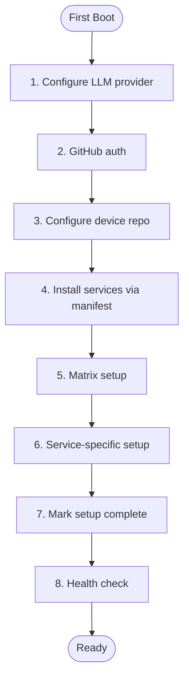

# piBloom First-Boot Setup

> [Emoji Legend](LEGEND.md)

This guide is for the first interactive session on a freshly installed Bloom OS machine.

> Important: commands like `service_install`, `manifest_apply`, `bloom_repo` are **Pi tools**.
> They are not shell binaries unless explicitly wrapped by your environment.



## 0) Prerequisite

If `~/.bloom/.setup-complete` exists, first-boot was already completed.

Fresh Bloom OS images grant user `bloom` passwordless `sudo` for bootstrap operations.

## 1) LLM provider and API key

Configure your preferred provider in Pi (OpenAI, Anthropic, etc.) and validate with a short prompt.

## 2) GitHub auth (for PR-based self-evolution)

```bash
gh auth login
gh auth status
```

## 3) Configure device repo for PR flow

Use Pi tools (recommended):

1. `bloom_repo(action="configure", repo_url="https://github.com/pibloom/pi-bloom.git")`
2. `bloom_repo(action="status")`
3. `bloom_repo(action="sync", branch="main")`

Expected local path:

- `~/.bloom/pi-bloom`

## 4) Configure optional service modules (manifest-first)

Declare desired services in `~/Bloom/manifest.yaml` via tool calls:

- `manifest_set_service(name="dufs", image="docker.io/sigoden/dufs:latest", version="0.1.0", enabled=true)`

Preview:

- `manifest_apply(dry_run=true)`

Apply:

- `manifest_apply(install_missing=true)`

## 5) Matrix setup

Matrix homeserver (`bloom-matrix.service`) is baked into the OS image and starts automatically.

Verify it's running:

```bash
systemctl status bloom-matrix
```

Install Cinny web client:

- `service_install(name="cinny")` or `manifest_set_service(name="cinny", image="ghcr.io/cinnyapp/cinny:v4.3.0", version="0.1.0", enabled=true)`

Pi creates its bot account automatically, then guides the user through:

1. Opening Cinny at `http://<host>/cinny/`
2. Registering with the registration token
3. Creating a DM with `@pi:bloom`
4. Verifying messaging works

## 6) Service-specific follow-up

### NetBird

NetBird is installed as a system RPM service on the OS image.

Authenticate:

```bash
sudo netbird up
```

Check status:

```bash
sudo netbird status
```

### Messaging Bridges (Optional)

To connect WhatsApp, Telegram, or Signal, use Pi's bridge tools:

- `bridge_create(bridge="whatsapp")` — pulls mautrix-whatsapp, creates Quadlet, registers appservice
- `bridge_status` — check bridge container states

## 7) Mark setup complete

```bash
touch ~/.bloom/.setup-complete
```

## 8) Health check

Run:

- `system_health`
- `manifest_show`
- `manifest_sync(mode="detect")`

## Related

- [Emoji Legend](LEGEND.md) — Notation reference
- [Quick Deploy](quick_deploy.md) — OS build and deployment
- [Fleet PR Workflow](fleet-pr-workflow.md) — Fleet contribution and PR workflow
- [AGENTS.md](../AGENTS.md) — Extension, tool, and hook reference
